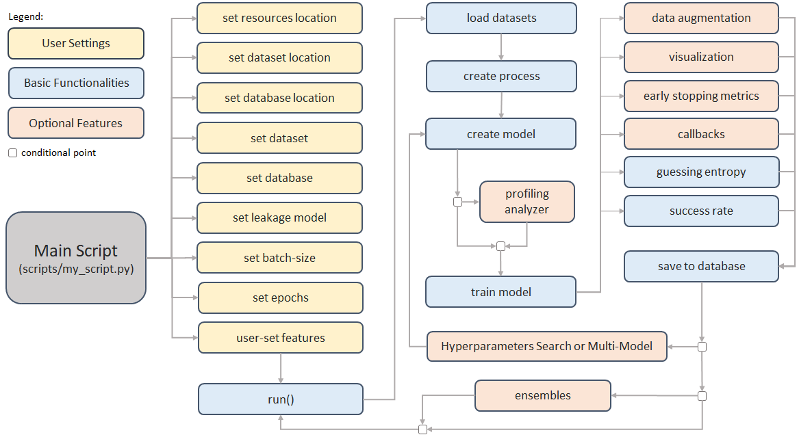

# Concepts

AISY Framework v0.1 works in a specific setting of *known-key side-channel analysis*. 
Therefore, for each analysis, the user must clearly provide with dataset definitions what is the correct key of the target device.

### AISY Framework Map

Figure below illustrates the main framework flow. In blue, we depict the operations that are basic to the framework (those that always 
execute). In light orange, we depict the optional features.



### Web Application

AISY Framework provides a web application to visualize results when they are stored in database files. To start the web application on localhost, user must run the following command in the project root folder:

```
flask run
```  

The user must set the main paths in ```app.py``` file:

```python
databases_root_folder = "my_path/AISY_framework/resources/databases/"
datasets_root_folder = "my_dataset_folder/"
resources_root_folder = "my_path/AISY_framework/resources/"
```
