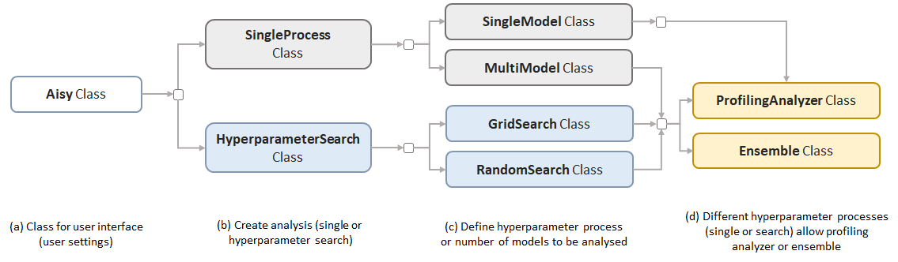

# Concepts

AISY Framework v0.1 works in a specific setting of *known-key side-channel analysis*. 
Therefore, for each analysis, the user must clearly provide with dataset definitions what is the correct key of the target device.

### AISY Framework Flow

Figure below illustrates the main framework flow. In blue, we depict the operations that are basic 
to the framework (those that always execute). In light orange, we depict the optional features.
The user settings are shown in yellow. The "conditional point" indicates the moment when the framework
check a conditional statement in order to verify if a functionality is executed or not. 


### Main Functionalities

Figure belows illustrates the main functionalities implemented in AISY framework. Basically, a user
can deploy a single process or hyperparameter search process. For single process, user can train a single
model or multiple models. This means that in the main script, the user can enter multiple neural networks 
to be trained by the framework. In case of hyperparameter search process, user can select between grid or 
random search.

Two additional functionalities are provided with the framework: **ProfilingAnalyzer** and **Ensemble**.
Profiling Analyzer can be executed in all situations (single model, multi-model or hyperparameter search).
Ensemble requires multiple models to be executed.



### Web Application

AISY Framework provides a web application to visualize results when they are stored in database files. To start the web application on localhost, user must run the following command in the project root folder:

```
flask run
```  

The user must set the main paths in ```app.py``` file:

```python
databases_root_folder = "my_path/AISY_framework/resources/databases/"
datasets_root_folder = "my_dataset_folder/"
resources_root_folder = "my_path/AISY_framework/resources/"
```
