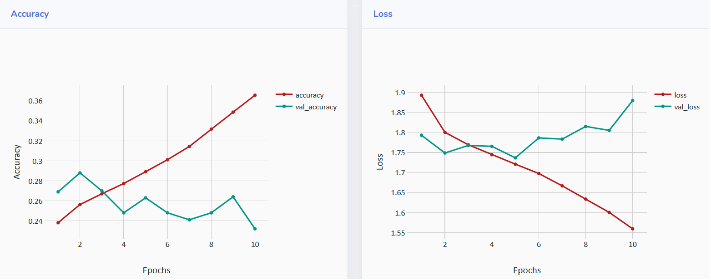
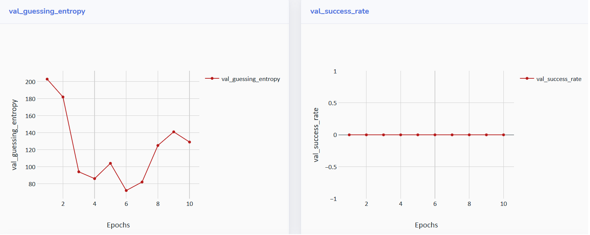
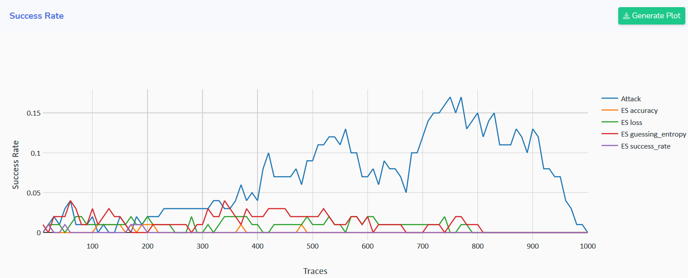

# Custom Early Stopping Metrics

AISY Framework allows easy definition of custom metrics to be monitored during training. This is specially important when *early stopping* 
is considered in the profiled SCA.

Custom metrics are processed in a standard callback, ```EarlyStoppingCallback```.  Therefore, an ```early_stopping``` dictionary is passed
to the ```run``` method:

```python
early_stopping = {
    "metrics": {
        "accuracy": {
            "direction": "max",
            "class": "accuracy",
            "parameters": []
        },
        "loss": {
            "direction": "min",
            "class": "loss",
            "parameters": []
        },
        "guessing_entropy": {
            "direction": "min",
            "class": "guessing_entropy",
            "parameters": []
        },
        "success_rate": {
            "direction": "max",
            "class": "success_rate",
            "parameters": []
        }
    }
}
```

In the example above, we have four custom metrics. Of course, these four metrics are already implemented as standard metrics in the AISY
Framework. However, these standard metrics will only be used in the early stopping mechanism if included in the ```early_stopping``` 
dictionary.

Note that for each metric we have three attributes: ```direction```, ```class``` and ```parameters```. The ```direction``` indicates what is 
the reference (min or max) to be detected as best achieved value. The ```class``` indicates the name of the python file containing the code for the metric 
and **must be placed in** ```custom/custom_metrics/``` directory.

### Step 1: Creating custom metric .py file

Create a new .py file named with the attribute ```class``` as defined in ```early_stopping```. Following the ```early_stopping``` dictionary
from the above example, we create four python files inside ```custom/custom_metrics/``` directory: 

- ```accuracy.py```   
- ```loss.py```   
- ```guessing_entropy.py```   
- ```success_rate.py```

##### Standard custom metric file structure (standard parameters)

Inside each of this files, create the following basic method ```run```:

```python
def run(x_profiling, y_profiling, plaintexts_profiling,
        ciphertexts_profiling, key_profiling,
        x_validation, y_validation, plaintexts_validation,
        ciphertexts_validation, key_validation,
        x_attack, y_attack, plaintexts_attack,
        ciphertexts_attack, key_attack,
        param, aes_leakage_model,
        key_rank_executions, key_rank_report_interval, key_rank_attack_traces,
        model, *args):
    pass
```   

where parameters are explained below

- ```x_profiling:``` profiling trace set.
- ```y_profiling:``` categorical profiling set labels.
- ```plaintexts_profiling:``` profiling set plaintext.
- ```ciphertexts_profiling:``` profiling set ciphertexts.
- ```key_profiling:``` profiling set key (can be a different key per trace).
- ```x_validation:``` validation trace set.
- ```y_validation:``` categorical validation set labels.
- ```plaintexts_validation:``` validation set plaintexts.
- ```ciphertexts_validation:``` validation set ciphertexts.
- ```key_validation:``` validation set key.
- ```x_attack:``` attack trace set.
- ```y_attack:``` categorical attack set labels.
- ```plaintexts_attack:``` attack set plaintexts.
- ```ciphertexts_attack:``` attack set ciphertexts.
- ```key_attack:``` attack set key.
- ```param:``` target parameteres. It is a dictionary as in the example below:
```python
param = {
            "filename": "ascad-variable.h5",
            "key": "00112233445566778899AABBCCDDEEFF",
            "first_sample": 0,
            "number_of_samples": 1400,
            "number_of_profiling_traces": 100000,
            "number_of_attack_traces": 2000
        }
```
- ```aes_leakage_model:``` leakage model parameters. It is a dictionary as in the example below:
```python
aes_leakage_model = {
            "leakage_model": "HW",  # "HW", "ID" or "bit"
            "byte": byte,
        }
``` 
- ```key_rank_executions:``` number of key rank executions in the guessing entropy calculatioin.
- ```key_rank_report_interval:``` report trace interval in metric calculations (e.g., guessing entropy, success rate, etc.)
- ```key_rank_attack_traces:``` number of randomly selected traces from attack trace set to be used in each key rank calculation.
- ```model:``` keras (neural network) model.
- ```*args:``` list of additional and optional ```parameters``` to be passed with ```early_stopping``` dictionary. 

##### Examples of custom metric files

For ```accuracy.py``` metric, the code can be defined as in the example below:

```python
def run(x_profiling, y_profiling, plaintexts_profiling,
        ciphertexts_profiling, key_profiling,
        x_validation, y_validation, plaintexts_validation,
        ciphertexts_validation, key_validation,
        x_attack, y_attack, plaintexts_attack,
        ciphertexts_attack, key_attack,
        param, aes_leakage_model,
        key_rank_executions, key_rank_report_interval, key_rank_attack_traces,
        model, *args):

    loss, acc = model.evaluate(x_validation, y_validation, verbose=0)
    return acc
```

For ```loss.py``` metric, the code can be defined as in the example below:

```python
def run(x_profiling, y_profiling, plaintexts_profiling,
        ciphertexts_profiling, key_profiling,
        x_validation, y_validation, plaintexts_validation,
        ciphertexts_validation, key_validation,
        x_attack, y_attack, plaintexts_attack,
        ciphertexts_attack, key_attack,
        param, aes_leakage_model,
        key_rank_executions, key_rank_report_interval, key_rank_attack_traces,
        model, *args):

    loss, _ = model.evaluate(x_validation, y_validation, verbose=0)
    return loss
```

Below, we provide a full example for ```guessing_entropy.py``` where guessing entropy is calculated for the validation trace set having one 
byte of S-Box output of first AES encryption round as target state. The ```run``` method returns the guessing entropy after processing 
```key_rank_attack_traces``` validation traces.

```python
import numpy as np
import random
from sklearn.utils import shuffle

sbox = np.array([
    0x63, 0x7C, 0x77, 0x7B, 0xF2, 0x6B, 0x6F, 0xC5, 0x30, 0x01, 0x67, 0x2B, 0xFE, 0xD7, 0xAB, 0x76,
    0xCA, 0x82, 0xC9, 0x7D, 0xFA, 0x59, 0x47, 0xF0, 0xAD, 0xD4, 0xA2, 0xAF, 0x9C, 0xA4, 0x72, 0xC0,
    0xB7, 0xFD, 0x93, 0x26, 0x36, 0x3F, 0xF7, 0xCC, 0x34, 0xA5, 0xE5, 0xF1, 0x71, 0xD8, 0x31, 0x15,
    0x04, 0xC7, 0x23, 0xC3, 0x18, 0x96, 0x05, 0x9A, 0x07, 0x12, 0x80, 0xE2, 0xEB, 0x27, 0xB2, 0x75,
    0x09, 0x83, 0x2C, 0x1A, 0x1B, 0x6E, 0x5A, 0xA0, 0x52, 0x3B, 0xD6, 0xB3, 0x29, 0xE3, 0x2F, 0x84,
    0x53, 0xD1, 0x00, 0xED, 0x20, 0xFC, 0xB1, 0x5B, 0x6A, 0xCB, 0xBE, 0x39, 0x4A, 0x4C, 0x58, 0xCF,
    0xD0, 0xEF, 0xAA, 0xFB, 0x43, 0x4D, 0x33, 0x85, 0x45, 0xF9, 0x02, 0x7F, 0x50, 0x3C, 0x9F, 0xA8,
    0x51, 0xA3, 0x40, 0x8F, 0x92, 0x9D, 0x38, 0xF5, 0xBC, 0xB6, 0xDA, 0x21, 0x10, 0xFF, 0xF3, 0xD2,
    0xCD, 0x0C, 0x13, 0xEC, 0x5F, 0x97, 0x44, 0x17, 0xC4, 0xA7, 0x7E, 0x3D, 0x64, 0x5D, 0x19, 0x73,
    0x60, 0x81, 0x4F, 0xDC, 0x22, 0x2A, 0x90, 0x88, 0x46, 0xEE, 0xB8, 0x14, 0xDE, 0x5E, 0x0B, 0xDB,
    0xE0, 0x32, 0x3A, 0x0A, 0x49, 0x06, 0x24, 0x5C, 0xC2, 0xD3, 0xAC, 0x62, 0x91, 0x95, 0xE4, 0x79,
    0xE7, 0xC8, 0x37, 0x6D, 0x8D, 0xD5, 0x4E, 0xA9, 0x6C, 0x56, 0xF4, 0xEA, 0x65, 0x7A, 0xAE, 0x08,
    0xBA, 0x78, 0x25, 0x2E, 0x1C, 0xA6, 0xB4, 0xC6, 0xE8, 0xDD, 0x74, 0x1F, 0x4B, 0xBD, 0x8B, 0x8A,
    0x70, 0x3E, 0xB5, 0x66, 0x48, 0x03, 0xF6, 0x0E, 0x61, 0x35, 0x57, 0xB9, 0x86, 0xC1, 0x1D, 0x9E,
    0xE1, 0xF8, 0x98, 0x11, 0x69, 0xD9, 0x8E, 0x94, 0x9B, 0x1E, 0x87, 0xE9, 0xCE, 0x55, 0x28, 0xDF,
    0x8C, 0xA1, 0x89, 0x0D, 0xBF, 0xE6, 0x42, 0x68, 0x41, 0x99, 0x2D, 0x0F, 0xB0, 0x54, 0xBB, 0x16
])


def aes_labelize_ge_sr(plt_attack, byte, key, leakage):
    pt_ct = [row[byte] for row in plt_attack]

    key_byte = np.full(len(pt_ct), key[byte])
    state = [int(x) ^ int(k) for x, k in zip(np.asarray(pt_ct[:]), key_byte)]

    intermediate_values = sbox[state]

    if leakage == "HW":
        return [bin(iv).count("1") for iv in intermediate_values]
    else:
        return intermediate_values


def run(x_profiling, y_profiling, plaintexts_profiling,
        ciphertexts_profiling, key_profiling,
        x_validation, y_validation, plaintexts_validation,
        ciphertexts_validation, key_validation,
        x_attack, y_attack, plaintexts_attack,
        ciphertexts_attack, key_attack,
        param, aes_leakage_model,
        key_rank_executions, key_rank_report_interval, key_rank_attack_traces,
        model, *args):
    leakage_model = aes_leakage_model["leakage_model"]
    target_byte = aes_leakage_model["byte"]
    key = param["key"]

    nt = len(x_validation)
    nt_interval = int(key_rank_attack_traces / key_rank_report_interval)
    key_ranking_sum = np.zeros(nt_interval)

    # ---------------------------------------------------------------------------------------------------------#
    # compute labels for key hypothesis
    # ---------------------------------------------------------------------------------------------------------#
    labels_key_hypothesis = np.zeros((256, nt))
    for key_byte_hypothesis in range(0, 256):
        key_h = bytearray.fromhex(key)
        key_h[target_byte] = key_byte_hypothesis
        labels_key_hypothesis[key_byte_hypothesis][:] = aes_labelize_ge_sr(plaintexts_validation, target_byte, key_h, leakage_model)

    good_key = [int(x) for x in bytearray.fromhex(key)][target_byte]

    # ---------------------------------------------------------------------------------------------------------#
    # predict output probabilities for shuffled test or validation set
    # ---------------------------------------------------------------------------------------------------------#
    output_probabilities = model.predict(x_validation)

    probabilities_kg_all_traces = np.zeros((nt, 256))
    for index in range(nt):
        probabilities_kg_all_traces[index] = output_probabilities[index][
            np.asarray([int(leakage[index]) for leakage in labels_key_hypothesis[:]])  # array with 256 leakage values (1 per key guess)
        ]

    for key_rank_execution in range(key_rank_executions):

        probabilities_kg_all_traces_shuffled = shuffle(probabilities_kg_all_traces, random_state=random.randint(0, 100000))
        key_probabilities = np.zeros(256)

        kr_count = 0
        for index in range(key_rank_attack_traces):

            key_probabilities += np.log(probabilities_kg_all_traces_shuffled[index] + 1e-36)
            key_probabilities_sorted = np.argsort(key_probabilities)[::-1]

            if (index + 1) % key_rank_report_interval == 0:
                key_ranking_good_key = list(key_probabilities_sorted).index(good_key) + 1
                key_ranking_sum[kr_count] += key_ranking_good_key
                kr_count += 1

        final_kr = key_ranking_sum[nt_interval - 1]
        print("KR run: {} | final Guessing Entropy for correct key ({}): {})".format(key_rank_execution + 1, good_key,
                                                                                     final_kr / (key_rank_execution + 1)))

    guessing_entropy = key_ranking_sum / key_rank_executions

    return guessing_entropy[nt_interval - 1]

``` 

### Step 2: Calling early stopping custom metrics from script

The code below provides an example of how to call early stopping custom metrics from the main script:

```python
import aisy_sca
from app import *
from custom.custom_models.neural_networks import *

aisy = aisy_sca.Aisy()
aisy.set_resources_root_folder(resources_root_folder)
aisy.set_database_root_folder(databases_root_folder)
aisy.set_datasets_root_folder(datasets_root_folder)
aisy.set_database_name("database_ascad.sqlite")
aisy.set_dataset(datasets_dict["ascad-variable.h5"])
aisy.set_aes_leakage_model(leakage_model="HW", byte=2)
aisy.set_batch_size(400)
aisy.set_epochs(10)
aisy.set_neural_network(mlp)

early_stopping = {
    "metrics": {
        "accuracy": {
            "direction": "max",
            "class": "custom.custom_metrics.accuracy",
            "parameters": []
        },
        "loss": {
            "direction": "min",
            "class": "custom.custom_metrics.loss",
            "parameters": []
        },
        "number_of_traces": {
            "direction": "min",
            "class": "custom.custom_metrics.number_of_traces",
            "parameters": []
        },
        "success_rate": {
            "direction": "max",
            "class": "custom.custom_metrics.success_rate",
            "parameters": []
        }
    }
}

aisy.run(
    early_stopping=early_stopping,
    key_rank_attack_traces=500
)

metrics_validation = aisy.get_metrics_validation()
for metric in metrics_validation:
    print("{}: {}".format(metric['metric'], metric['values']))
```

### Returning a tuple (or list of values) in the custom metric

In the metric examples above (```accuracy.py```, ```loss.py``` and ```guessing_entropy.py```), each metric returns a single (float) value. It
also possible to return a tuple or a list of values instead of a single value.  

### Retrieving the early stopping metric values

As in the example above, the method

```python
metrics_validation = aisy.get_metrics_validation()
```

returns the list of defined early stopping metrics and their values for each epoch. Running the above code, the user should get a results 
similar to the following one:

```
val_accuracy: [0.269, 0.288, 0.27, 0.248, 0.263, 0.248, 0.241, 0.248, 0.264, 0.232]
val_loss: [1.7930998115539551, 1.7487744626998902, 1.7676906442642213, 1.7654361686706543, 1.7366435260772706, 1.7864224281311034, 1.7834029178619384, 1.8150662136077882, 1.8051397848129271, 1.8797064323425292]
val_guessing_entropy: [203.0, 182.0, 94.0, 86.0, 104.0, 72.0, 82.0, 125.0, 141.0, 129.0]
val_success_rate: [0.0, 0.0, 0.0, 0.0, 0.0, 0.0, 0.0, 0.0, 0.0, 0.0]
```

### Visualizing metric results in the Web Application

It is also important to note that custom metric retuls are also stored in the defined SQLite database file. 
Plots can also be observed in the web application interface that runs on ```localhost```. 

The plots can be seen as in the example below:

 
 

For each early stopping metric, the framework computes the guessing entropy:

  

In the above plot, the ```Attack``` label (in blue) denotes the guessing entropy of a single key byte computed after all processed epochs (end of training).
The other lines refer to the guessing entropy at the epoch where the correspondent metric achieves the best value.
The same type of result is provided for success rates:

  