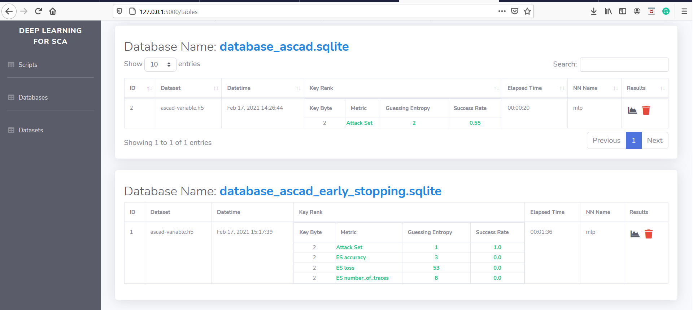
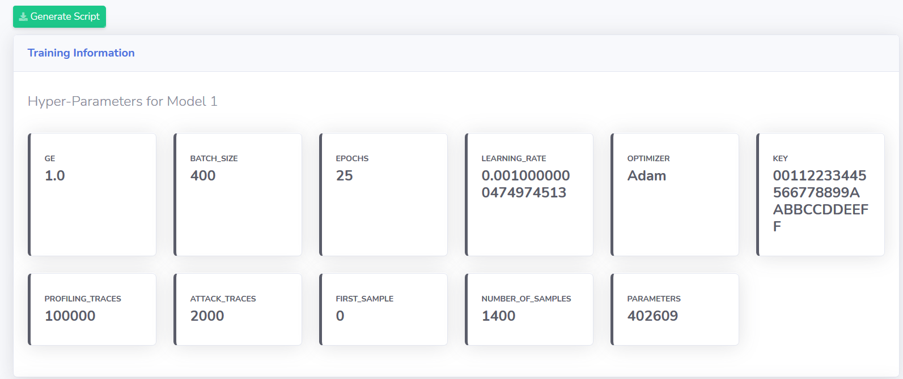

# Automatically Generating Scripts

One of the main features in AISY Framework is the one-click script generation.

By clicking on **Databases** on the side-bar, the list of analysis separated per database file name is displayed in the screen.



The user then clicks on the chart icon in the **Results** column. The page then displays something similar to the image below:



In the top right part of the screen, there is a button called *Generate Script*. If the user clicks on this button, the script used to 
produce results displayed in the current page is automatically generated and placed in ```scripts/``` folder under the name 
```script_[analysis_id]_[database_name].py```.

The advantage of this feature is the possibility to reproduce results from older analysis when script is updated or even modified by accident.
Another advantage is that is databases are shared between users, the *Generate Script* button allows different users to reproduce same analysis.
