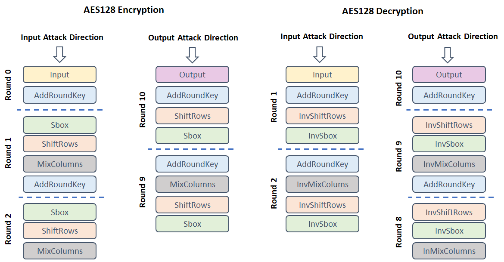

## Leakage Models

AISY Framework v0.2 only has support for AES128 leakage models. 
Future releases will include leakage models support for additional ciphers.

### Definiting Leakage Models

In the main script, the user needs to call the method ```set_aes_leakage_model()``` and pass AES leakage model attributes.
The attributes are:

- ```leakage_model: ``` Hamming weight ("HW"), Hamming distance ("HD"), Identity ("ID") or "bit".
- ```bit: ``` index of the target bit in a byte (the ```byte``` attribute also has to be defined if bit model is set).
- ```byte: ``` index of the target byte in a AES state.
- ```round: ``` index of the target round in AES.
- ```round_first: ``` index of the first target round in AES when Hamming distance is set as leakage model.
- ```round_second: ``` index of the second target round in AES when Hamming distance is set as leakage model. Intermediates obtained from round_first and round_second are XORed.
- ```target_state: ``` string specifying the target AES state. Supported values are: 'Input', 'Output', 'Sbox', InvSbox', 'AddRoundKey', 'MixColumns', 'InvMixColumns', 'ShiftRows' and 'InvShiftRows'.
- ```target_state_first: ``` string specifying the first target AES state when Hamming distance is set as leakage model. Supported values are: 'Input', 'Output', 'Sbox', InvSbox', 'AddRoundKey', 'MixColumns', 'InvMixColumns', 'ShiftRows' and 'InvShiftRows'.
- ```target_state_second: ``` string specifying the second target AES state when Hamming distance is set as leakage model. Supported values are: 'Input', 'Output', 'Sbox', InvSbox', 'AddRoundKey', 'MixColumns', 'InvMixColumns', 'ShiftRows' and 'InvShiftRows'.
- ```direction: ``` string defining the AES direction. Supported values are "Encryption" and "Decryption".
- ```attack_direction: ``` string defining the attack direction to create the leakage models. Supported values are "input" and "output", both lowercase.

### Supported AES States for Leakage Models

Figure below illustrates the AES states that the user can target in leakage model definitions. 




### Default Values

The framework set the following as default ones:

```python
leakage_model = {
    "leakage_model": "HW",
    "bit": 0,
    "byte": 0,
    "round": 1,
    "round_first": 1,  # for Hamming Distance
    "round_second": 1,  # for Hamming Distance
    "cipher": "AES128",
    "target_state": "Sbox",
    "target_state_first": "Sbox",  # for Hamming Distance
    "target_state_second": "Sbox",  # for Hamming Distance
    "direction": "Encryption",
    "attack_direction": "input"
}
```

If the default values are the same as the user needs to select, the ```set_aes_leakage_model()``` method does not need to be set in the main script. 

### Examples

###### Hamming weight model, S-Box Output Round 1, AES Encryption

```python
aisy = aisy_sca.Aisy()
aisy.set_aes_leakage_model(leakage_model="HW", byte=0, target_state="Sbox", direction="Encryption",
                           cipher="AES128")
```

###### Hamming weight model, S-Box Input Round 10, AES Encryption

```python
aisy = aisy_sca.Aisy()
aisy.set_aes_leakage_model(leakage_model="HW", byte=0, target_state="Sbox", round=10, 
                           attack_direction="output", direction="Encryption", cipher="AES128")
```

###### Identity model, S-Box Output Round 1, AES Encryption

```python
aisy = aisy_sca.Aisy()
aisy.set_aes_leakage_model(leakage_model="ID", byte=0, target_state="Sbox", direction="Encryption",
                           cipher="AES128")
```

###### Bit 3, Byte 5,  S-Box Output Round 1, AES Encryption

```python
aisy = aisy_sca.Aisy()
aisy.set_aes_leakage_model(leakage_model="bit", bit=3, byte=5, target_state="Sbox", 
                           direction="Encryption", cipher="AES128")
```

###### Hamming distance between S-Box Input in round 10 and output (ciphertext), AES Encryption, byte 0

```python
aisy = AisyAes()
aisy.set_aes_leakage_model(leakage_model="HD", byte=0, direction="Encryption", cipher="AES128",
                           target_state_first="Output", round_first=10,
                           target_state_second="Sbox", round_second=10,
                           attack_direction="output")
```

