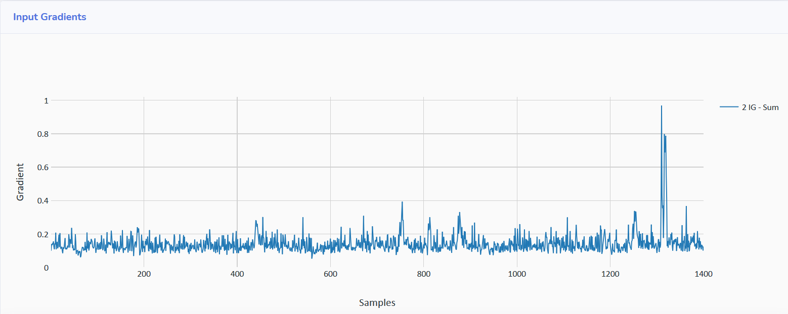
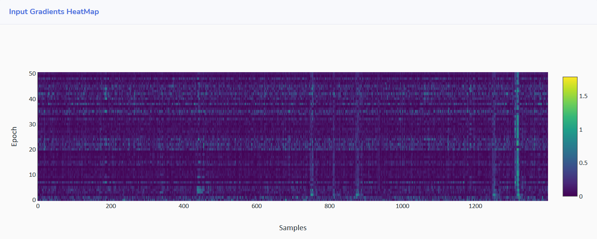

# Visualization

AISY Framework provides an input gradient visualization feature. The feature allows the visual verification of main input features learned 
from input traces.  

## Example Code

```python
import aisy_sca
from app import *
from custom.custom_models.neural_networks import *

aisy = aisy_sca.Aisy()
aisy.set_resources_root_folder(resources_root_folder)
aisy.set_database_root_folder(databases_root_folder)
aisy.set_datasets_root_folder(datasets_root_folder)
aisy.set_database_name("database_ascad.sqlite")
aisy.set_dataset(datasets_dict["ascad-variable.h5"])
aisy.set_aes_leakage_model(leakage_model="HW", byte=2)
aisy.set_batch_size(400)
aisy.set_epochs(20)
aisy.set_neural_network(mlp)

aisy.run(visualization=[4000])
```

The amount 4000 represents the number of profiling traces that are used to compute input gradient. Results are given in two ways, as 
explained below.

### Sum of Input Gradients

The sum of input gradients provides the sum of input gradients computed over all preset profiling traces and for all the processed epochs.
In the web application, results should appear as shown below:



### Input Gradients per Epoch

The web application also provides the input gradient computed over all preset profiling traces for each epoch in a heatmap plot, as shown 
below:




